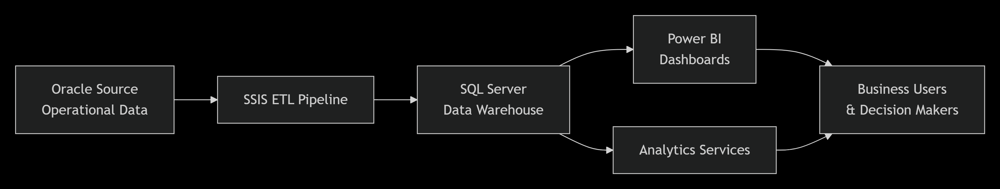
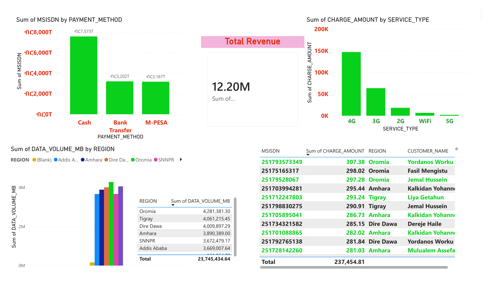
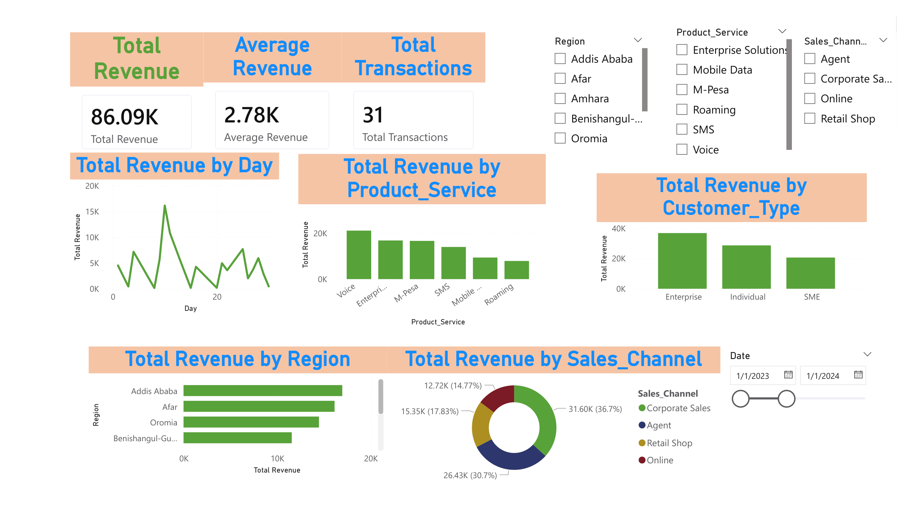

# Safaricom Ethiopia Telecom Analytics Data Warehouse & BI Solution


## 📌 Project Overview
This project demonstrates a full-scale Business Intelligence (BI) lifecycle designed for **Safaricom Ethiopia**. The goal is to provide executive-level insights into airtime revenue, data consumption (4G/5G), and regional subscriber growth by integrating data from a legacy Oracle Billing system into a modern SQL Server Data Warehouse.

### 🏗️ Architecture Flow



---

## 📊 Power BI Dashboard
> **Note on Data Source:**  This project utilizes a simulated dataset designed to replicate the complexity and scale of Safaricom Ethiopia’s transactional environment. While the data is synthetic, it maintains the referential integrity and business logic required for production-level ETL and analytical reporting. Two separate datasets utilized to develop two repots, displayed below.
#### Executive Revenue Summary




## 🛠️ Tech Stack & Components

| Component | Technology | Description |
| :--- | :--- | :--- |
| **Source DB** | Oracle 19c | Production Billing & CDR (Call Detail Records) |
| **ETL Tool** | SSIS 2022 | Extraction, Data Type Mapping, and Fact Loading |
| **Warehouse** | MS SQL Server | Optimized Star Schema for analytical querying |
| **Visualization** | Power BI | Interactive Dashboards & DAX Reporting |

---

## Implementation Steps

### Phase 1: Data Warehouse Development (SQL Server)
Navigate to the `01_Database_Scripts/Oracle_Source_Tables/` folder.  
1. Run `01_Create_Source_Tables.sql` in SQL Server Management Studio (SSMS).  
2. This creates the Star Schema:  
   - **FactRevenueUsage**: Stores metrics (Revenue, MBs, Minutes).  
   - **Dim_Customer**: SCD Type 1 for customer demographics.  
   - **Dim_Date**: Time dimension including Ethiopian calendar attributes.  
3. Then generate SAMPLE SAFARICOM ETHIOPIA synthetic dataset within SSMS by running the script `02_Sample_Data_Generator.sql` which is in the same folder.  

---

### Phase 2: ETL Logic (SSIS)
1. **Connection**: Established ADO.NET/OLEDB connection to the Oracle Source.  
2. **Extraction**: SQL query used to pull incremental logs from `TBL_RECHARGE_LOGS`.  
3. **Transformation**:  
   - Data Conversion: Mapped Oracle NUMBER to SQL Decimal.  
   - Lookup: Mapped MSISDN to SubscriberSK from the Dimension table.  
   - Derived Column: Calculated Tax (15% VAT) on top-ups.  
4. **Loading**: Data is pushed into the SQL Server Fact table using Fast Load.  

---

### Phase 3: Power BI Modeling & Visualization
1. **Data Import**: Connected to SQL Server using Import Mode.  
2. **Data Modeling**: Established a 1-to-Many relationship between Dimensions and Facts.  
3. **DAX Measures Created**:  
   - `Total Revenue = SUM(FactRevenueUsage[Amount])`  
   - `Revenue WoW % = DIVIDE([Total Revenue] - [Last Week Revenue], [Last Week Revenue])`  
4. **Dashboard Features**:  
   - Regional Top: Top Revenue across regions of Ethiopia (Addis, Dire Dawa, Bahir Dar, ...).  
   - Trend Analysis: Daily data usage per customers.  

---

## 5. How to Run This Project
1. Clone the Repo:  
   ```bash
   git clone https://github.com/ake369/Safaricom-BI-Project.git

- Setup DB: Execute scripts in SQL Server to create the SQLServer_DW.
- Configure SSIS: Update the Connection Managers in the .dtsx package with your local Oracle/SQL credentials.
- Run ETL: Execute the SSIS package to populate the warehouse.
- View Report: Open the .pbit file in Power BI and point it to your local SQL Server.

6. Sample Insights
- Regional Growth: Total revenue
- Top performer region in terms of transactions
- Top customer
- Payment method per sum customer
- Data usage per service type

📖 Publisher Information
- Project Author/Publisher: Akalu Abraham (BI Specialist)
- Version: 1.0.0
- License: MIT License
- Contact: ake.abrish@gmail.com

